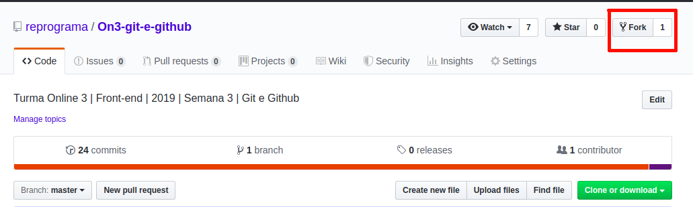

# Exercício de contribuição em um projeto onde você é colaboradora

- Se você já fez `clone` do repositório dessa a aula, então não precisa fazer de novo.
- Este exercício para casa segue o mesmo fluxo que o exercício da pasta [5-exercicio-projeto-aula](https://github.com/reprograma/On3-git-e-github/tree/master/5-exercicio-projeto-aula). Você pode usar a apresentação daquele exercício como referência.

### Instruções
#### Configurações básicas iniciais
* Ter o git instalado na sua máquina	
* Abra o Git Bash
  ```
  git --version
  ```
* Verifique se seu usuário está configurado na sua máquina. (Deve aparecer seu ***user.name*** e ***user.email***)
	```
  git config --list
  ```

	* Caso não esteja configurado, fazer a configuração de ***user.name*** e ***user.email***
    ```
    git config --global user.name "Seu Nome"
    git config --global user.email "seu@email.com"
    ```

---
#### Caso vá fazer o fluxo do zero, desde o clone:

* Entre no Git Bash
* Verifique se está no diretório em que deseja clonar o repositório
	
  ```
  pwd
  ```
* Clonar o repositório desta aula
	
  ```
  git clone https://github.com/reprograma/On3-git-e-github.git
  ```

---

#### Caso vá continuar trabalhando no repositório já clonado durante a aula:
* Entrar nesse repositório local

	```
  cd On3-git-e-github/7-exercicio-projeto-casa
  ```
* Criar uma branch nova com seu nome.
	
  ```
  git checkout -b proj-casa-seuNome
  ```
* Entrar no VSCode

	```
  code .
  ```
* Entrar na pasta 7-exercicio-projeto-casa e siga as instruções a seguir.
* Alterar a imagem e o link para seu github na `<div>` que contiver seu nome.
	* Use o link do seu github para colocar no ***href*** na tag `<a>`. (Ex: https://github.com/reprograma)
	* Use o link da imagem do seu avatar no github para colocar no ***src*** da tag ``. Clique com o botão direito sobre a imagem do seu perfil no github e copie o endereço da imagem. (Ex: https://avatars0.githubusercontent.com/u/27314899?s=200&v=4)
    * Exemplo de como capturar o link da imagem:
      

  * Adicione seu nome no ***alt*** da tag ``

  Exemplo:

    **Antes:**

    ```
    <div class="container__aluna">
        <a href="#" target="_blank">
            
        </a>
        <p>Cintia Fumi</p>
    </div>
    ```
    
    **Depois:**
    
    ```
    <div class="container__aluna">
        <a href="https://github.com/cintiafumi" target="_blank">
            
        </a>
        <p>Cintia Fumi</p>
    </div>
    ```

* Conferir essa alteração no navegador (Chrome).
	* *Comportamento esperado: ao clicar na sua foto, o link do seu github irá se abrir numa aba nova*

* Voltando para o Git Bash.
* `git diff`: verificar o que você alterou no código.
* `git status`: verificar o status.
* `git add index.html`: Adicionar as alterações para área de preparação.
* `git status`: verificar o status novamente.
* `git commit -m "adicionando foto e link de Cíntia Fumi para Githbub"`: adicionar mensagem de ***commit***.
* `git push origin proj-casa-seuNome`: subir as alterações da sua branch para o seu repositório remoto.
* Verificar se as alterações foram atualizadas na sua branch lá no github (https://github.com/reprograma/On3-git-e-github)
* Ir para a aba ***Pull requests***
* Criar novo pull request ***Compare & pull request*** pelo github da reprograma verificando se está fazendo a solicitação da proj-casa-seuNome para a master
* *base: **master**    **<=**    compare: **proj-casa-seuNome***

---

#### Após todos ***pull request*** dessa aula serem aceitos, caso queria atualizar localmente seu repositório:
* No Git Bash, dentro deste repositório.
* `git checkout master`: voltar para a branch master
* `git pull origin master`: atualizar o repositório local
* Verificar no navegador (Chrome) se todas as atualizações vieram

---
#### Deletar sua branch após seu ***pull request*** ser aceito
* `git checkout master`: estar na branch **master** para remover sua branch
* `git branch -d proj-casa-seuNome`: deletar sua branch **proj-casa-seuNome**
  ```

---
#### Para ter este repositório no seu GitHub, existem 2 alternativas:
- Subindo como você subiu todos os seus projetos;
- Fazendo um ***fork*** pelo próprio repositório da Reprograma;

---
#### Subir esse repositório no seu github
* Criar um novo respositório no seu github https://github.com/new
* Copiar o link do repositório https://github.com/seuLogin/seuNovoRepositorio.git
* `git remote add meuRepo https://github.com/<seuLogin>/<seuNovoRepositorio>.git`: adicionar o link remoto pelo Git Bash. (Como o remote origin já está linkado ao repositório da Reprograma, iremos adicionar o seu remote com outro nome).
  Obs: Nesse link acima, substituir `<seuLogin>` e `<seuNovoRepositorio>` com informações do seu login e seu repositório.
* `git commit -m "Exercício para casa" --allow-empty`: fazer um ***commit*** vazio, pois tudo já foi adicionado anteriormente e não há novas alterações
* `git push meuRepo master`: Subir esse repositório local no seu repositório do GitHub.

---
#### Fazendo um ***fork*** pelo próprio repositório da Reprograma
* Ir no repositório da Reprograma e clicar em ***Fork***
