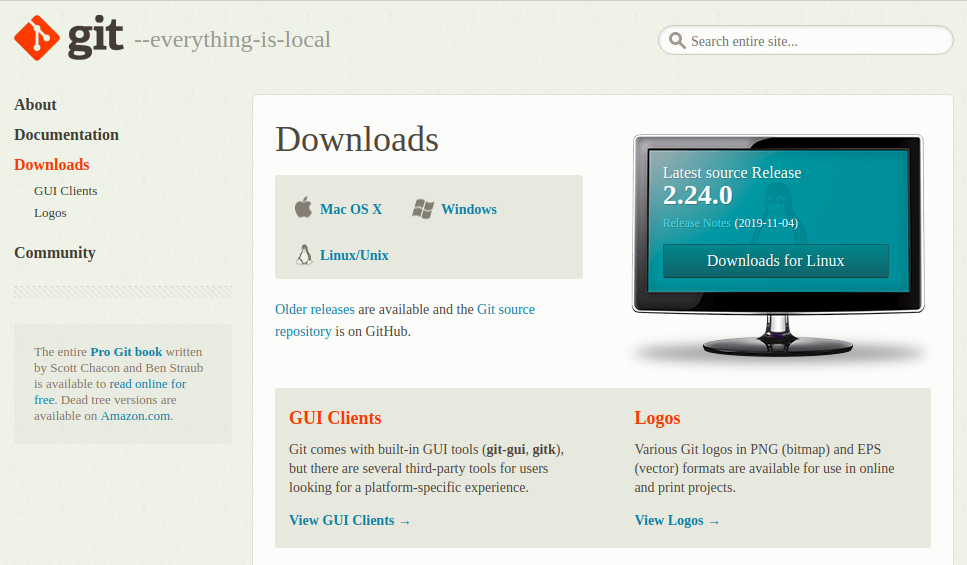
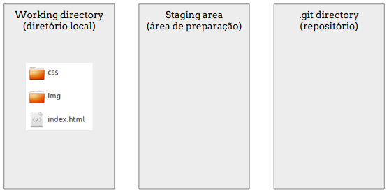
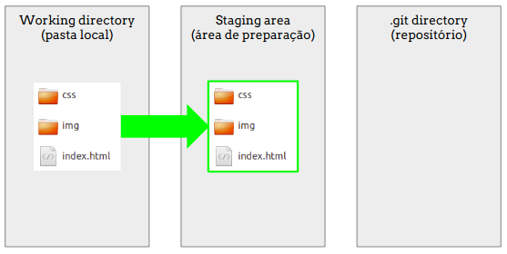
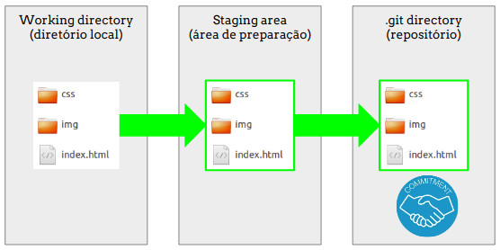
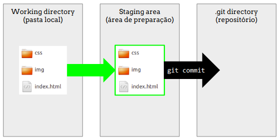

# Git e Github :purple_heart:

1. [O que é Git](#git)

2. [Instalação do Git](#instalacao)

3. [Linhas de comandos básicos do terminal (usando Git Bash)](#bash)

4. [Iniciando o controle de versão com o Git em um projeto existente na sua máquina](#gitinit)

5. [O que é Github :octocat: ](#github)

6. [Trabalhando em um projeto](#project)


## O que é Git <a name="git"></a>

<a href="https://git-scm.com/book/pt-br/v2" target="_blank">Git</a> é um sistema de controle de versões distribuído, usado principalmente no desenvolvimento de software para registrar o histórico de edições dos arquivos.

Git, é uma gíria britânica e significa “pessoa desagradável” ou "idiota".

O software foi desenvolvido por Linus Torvalds (criador do Linux). E é um software livre (open source).


Com o Git podemos desenvolver projetos colaborativos, com diversas pessoas trabalhando simultaneamente no mesmo código sem riscos de perdermos o que fizemos.

#### *Quem nunca salvou inúmeras versões de um arquivo?*


#### Como começar? :joy: :joy: :joy:


Tradução:

> _ Este é o *Git*. Ele rastreia o trabalho colaborativo em projetos através de um belo distribuído modelo de árvore da teoria dos grafos.
> _ Legal. Como usamos isso?
> _ Não tenho ideia. Apenas memorize esses comandos em shell e digite-os para sincronizar. Se você receber erros, salve seu trabalho em outro lugar, exclua o projeto e baixe uma nova cópia.

### Importância:

* ***Trabalho em equipe***: Diversos desenvolvedores trabalhando no mesmo projeto sem perder o que cada um fez

*  ***Histórico de modificações***: Guardamos um histórico de tudo que foi alterado, contendo informações detalhadas do que foi modificado (***arquivo***), o autor da modificação (***quem***) e o motivo da alteração (***mensagem***)

* ***Busca de informações***: Facilita um colaborador novo a se informar do que foi trabalhado já naquele projeto

---

## Instalação do Git <a name="instalacao"></a>

- Baixar o Git pelo site: https://git-scm.com/downloads

	

- Instalar o arquivo `Git-2.24.0-32-bit.exe`

- Abrir o Git Bash

---

## Linhas de comando básicos do terminal (usando Git Bash) <a name="bash"></a>

- Na sua Área de Trabalho (Desktop), clique com o botão direito e selecione ***Git Bash here***

	

Este é o ***Git Bash***. É como um terminal.

Então, executamos ações por meio de instruções de linha de comando.

Vamos executar algumas ações básicas para nos habituarmos com o terminal Git Bash.

**Mostrando o caminho (path)**

- Comando ***pwd*** (*path working directory*)

	```
	pwd
	```

**Listando o que tem nessa pasta**

- Comando ***ls*** (*list*)

	```
	ls
	```

**Criar uma pasta nova**

- ***mkdir***: *make a directory*

	```
	mkdir nome-pasta
	```

- Listar o conteúdo da pasta atual. (A pasta que acabou de ser criada deverá ser listada)

	```
	ls
	```

**Entrar numa pasta**

- Comando ***cd*** (*change directory*). Para entrar na pasta que criou anteriormente.

	```
	cd nova-pasta
	```
	
**Criando um arquivo**

- Criar um arquivo index.html pela linha de comando. O conteúdo será um texto "`<html>`". Comando ***echo***.

	```
	echo "<html>" > index.html
	```

- Listar o conteúdo da pasta atual. (O novo arquivo deverá ser listado)

	```
	ls
	```

**Deletando um arquivo**

- Comando ***rm*** (*remove*). Remover o arquivo `index.html`

	```
	rm index.html
	```

- Listar o conteúdo da pasta atual. (O novo arquivo deverá ter sido deletado)

	```
	ls
	```
	
- Voltar para a pasta acima. Comando ***cd*** . .

	```
	cd ..
	```

- Listar o conteúdo da pasta atual. (Deverá aparecer sua pasta criada anteriormente)

	```
	ls
	```

**Deletando uma pasta**

- Comando ***rm -r*** (*remove --recursive*)

	```
	rm -r nome-pasta
	```

	

**Ir para a raiz do computador**

- Voltar para a pasta raiz do seu computador. Comando ***cd***

	```
	cd
	```

- Ao dar o comando ***pwd*** aqui, verás que esse é o caminho "raiz" do seu computador.

---

## Iniciando o controle de versão com o Git em um projeto existente na sua máquina <a name="gitinit"></a>

### De: pasta local => Para: repositório remoto <a name="local-to-remote"></a>

#### O que vai acontecer por trás da linha de comando dentro da pasta do seu projeto:

Ilustração da pasta contendo todos os arquivos do projeto:



---

Esses arquivos devem ser adicionados a uma área de preparação (*staging area*)



---

É feito um acordo (*commit*) indicando os **arquivos**, o(a) **autor(a)** e a **mensagem** referente à modificação no projeto. A pasta oculta **.git** irá guardar o histórico com essas informações.



---

**Etapas para rastreamento local**:

Mantendo o controle de versão dos seus projetos
	
1. [Configuração de autoria](#config)

2. [Iniciar o rastreamento dos arquivos desse projeto](#init)

3. [Adicionar arquivos na área de preparação (staging area)](#add)

4. [Definir mensagem que descreve as alterações realizadas](#commit)

---

**Etapas para rastreamento remoto**:

Disponibilizando seu projeto para o mundo.

5. [Criar um repositório novo no Github](#remote)

6. [Subir essas informações no repositório remoto do Github](#push)

---

1. **Configuração de autoria** <a name="config"></a>

* Clicar com o botão direito e abrir o Git Bash selecionando ***Git Bash here***

* Configurar autoria. (Definição de quem vai assinar o compromisso pela mudança realizada)

	* Você está configurando seu usuário global com as informações de nome e email. Caso utilize o computador compartilhado com outras pessoas que também usam Git, fazer essa etapa de verificação sempre que for codar. Caso seja a única pessoa que utiliza o Git neste computador, você fará isso uma única vez.

	```
	git config --global user.name "Cintia Fumi"
	git config --global user.email "cintiafumi@gmail.com"
	```

* Verificar se suas informações de `user.name` e `user.email` foram configuradas com sucesso

	```
	git config --list
	```

---

2. **Rastrear os arquivos desse projeto** <a name="init"></a>

* Entrar na pasta do seu primeiro projeto ou a pasta de uma das aulas da Reprograma de semanas anteriores

* Clicar com o botão direito e abrir o Git Bash selecionando ***Git Bash here***

* Listar os arquivos dessa pasta. (Ex: ver os arquivos `index.html` e a pasta `css`)

	```
	ls
	```

* Iniciar o rastreamento. (Você deve estar DENTRO da pasta do projeto que quer rastrear)

	```
	git init
	```

* Listar os arquivos dessa pasta, incluindo os arquivos ocultos. E verificar se surgiu uma pasta oculta chamada .git na sua pasta

	```
	ls -a
	```

* Verificar o status da sua pasta

	```
	git status
	```

Significa que estamos nessa etapa:


---

3. **Adicionar arquivos na área de preparação (staging area)** <a name="add"></a>

* Adicionar o arquivo modificado. (Ex: `git add index.html`)

	```
	git add <nome do arquivo>
	```

*	Ou... Adicionar todos os arquivos

	```
	git add --all
	```

* Verificar o status da sua pasta

	```
	git status
	```

Significa que os arquivos foram adicionados para a área de preparação (*staging area*)


---

4. **Definir mensagem que descreve as alterações realizadas** <a name="commit"></a>

* Adicionar a mensagem dizendo o que você fez de alteração.

	```
	git commit -m "primeiro projeto da reprograma, contendo um site sobre mim"
	```
	
 A palavra *commit* significa comprometer-se. Isso significa que você assume o compromisso de que adicionou os arquivos novos (ou modificados), assinou a autoria e deixou uma mensagem dizendo o que foi alterado.
 


*Obs: é uma boa prática escrever uma mensagem coerente e clara sobre a alteração realizada, de maneira que fique intuitivo para quem lê depois*
	

	
* Verificar como ficou. (*log* significa registro, histórico)

	```
	git log
	```

	

Pronto! Sua pasta está com controle de versão!

Significa que *plantamos a árvore* e sua árvore está devidamente rastreada.


O Git estará de olho em tudo o que você alterar.


---

## O que é GitHub :octocat: <a name="github"></a>

**GitHub** é uma plataforma de hospedagem de código-fonte com controle de versão usando o Git. Ele permite que programadores, utilitários ou qualquer usuário cadastrado na plataforma contribuam em projetos privados e/ou Open Source de qualquer lugar do mundo. [[Wikipedia](https://pt.wikipedia.org/wiki/GitHub)]

[](https://youtu.be/w3jLJU7DT5E)

[vídeo GitHub](https://youtu.be/w3jLJU7DT5E)

---

5. **Criar um repositório novo no GitHub** <a name="remote><a>

* Cria uma conta no Github, caso você ainda não tenha.

* Entra na sua página do GitHub. (Fazer login)

* Criar um repositório novo e nomear

* Após criado um novo repositório lá no GitHub, seguir as instruções de adicionar o endereço remoto

	```
	git remote add origin 'https://github.com/<seuLogin>/<seuRepo>.git'
	```

* Verificar o endereço do repositório remoto

	```
	git remote -v
	```

* Verificar o status do seu repositório local

	```
	git status
	```

---

6. **Subir essas informações no repositório remoto do Github** <a name="push"><a>

* Como já havíamos salvo todas alterações no git localmente, agora é só subir as alterações locais para o repositório na nuvem

	```
	git push -u origin master
	```

Pronto! Verifique seu repositório no GitHub.

---

## Trabalhando em um projeto <a name="project"></a>

### De: repositório remoto => Para: pasta local <a name="local-to-remote"></a>

#### O que vai acontecer por trás da linha de comando:


Simulando o trabalho de uma equipe no mesmo projeto.

Faremos com este repositório aqui do GitHub.

**Etapas para trabalhar em um projeto distribuído**:
	
1. [Clonar o projeto](#ex-clone)

2. [Criar uma branch nova](#ex-branch)

3. [Fazer suas modificações na branch nova](#ex-coding)

4. [Verificar alterações](#ex-diff)

5. [Adicionar arquivos na área de preparação (staging area)](#ex-add)

6. [Definir mensagem que descreve as alterações realizadas](#ex-commit)

7. [Subir alteração da sua branch para o GitHub](#ex-push)

8. [Verificar se sua branch aparece no GitHub](#ex-github)

9. [Solicitar que sua alteração vá para a branch master (Criar pull request)](#ex-pull-request)

10. [Aguardar aprovação do seu código](#ex-merge)

---

1. **Clonar o projeto** <a name="ex-clone"></a>

* Escolha onde irá salvar o projeto e abra o Git Bash. (Não precisa criar uma pasta, pois o repositório já vem como uma pasta contendo todos arquivos).


* Verifique com os comandos `pwd` e/ou `ls` se você está no local certo onde quer colocar a pasta do projeto

* Clonar o repositório do projeto. (Esse comando irá criar uma pasta com o nome do repositório e contendo todos os arquivos)

	```
	git clone https://github.com/reprograma/On3-git-e-github.git
	```

* Entrar na pasta do projeto

	```
	cd On3-git-e-github
	```

---

2. **Criar uma branch nova** <a name="ex-branch"></a>

* Listar quais branchs existem (*branch* significa ramificação). Estamos listando quantas ramificações existem nesse projeto. A branch ***master*** equivale ao tronco principal da árvore do projeto. Tudo que está em produção, está na branch ***master***. Outras branchs significam que outras pessoas estão trabalhando nesse projeto e cada pessoa está em uma funcionalidade que ainda não está sendo desenvolvida

	```
	git branch -a
	```

* Para sair da branch atual ***master*** e ir para uma branch nova com ***seuNome***, use o comando abaixo

	```
	git checkout -b ex-aula-seuNome
	```

* Verifique novamente em que branch você se encontra

	```
	git branch -a
	```

A partir de agora, todas alterações feitas no projeto serão feitas somente na sua branch chamada ***seuNome***, evitando que você altere o projeto diretamente na branch ***master***

---

3. **Fazer suas modificações na branch nova** <a name="ex-coding"></a>

* Abrir o VSCode pela linha de comando

	```
	code .
	```

* Verificar no navegador (Chrome) como está o projeto. Abrir o arquivo `index.html` da pasta **exercicio-aula**

* Fazer sua alteração no código

* Verificar no navegador se as suas alterações estão conforme deseja

* Voltar para o Git Bash (dentro da pasta desse projeto)

---

4. **Verificar alterações** <a name="ex-diff"></a>

* Verificar alteraçoes pelo Git Bash

	```
	git diff
	```

* Este repositório já está rastreado, e por isso, já foi possível verificar as alterações pelo Git

* Verificar o status

	```
	git status
	```

---

5. **Adicionar arquivos na área de preparação (staging area)** <a name="ex-add"></a>

* Adicionar as alterações para a área de preparação

	```
	git add index.html
	```

* Verificar status novamente

	```
	git status
	```

---

6. **Definir mensagem que descreve as alterações realizadas** <a name="ex-commit"></a>

* Adicionar mensagem de commit

	```
	git commit -m "Adicionando minha presença na aula"
	```

---

7. **Subir alteração da sua branch para o GitHub** <a name="ex-push"></a>

* Subir alteração para o GitHub

	```
	git push origin ex-aula-seuNome
	```

---

8. **Verificar se sua branch aparece no GitHub** <a name="ex-github"></a>


---

9. **Solicitar que sua alteração vá para a branch master (Criar pull request)** <a name="ex-pull-request"></a>


---

10. **Aguardar aprovação do seu código** <a name="ex-merge"></a>

As outras pessoas de sua equipe irão revisar seu código (***code review***) e aprovar seu ***pull request***.

Isso significa que o código da sua branch **ex-aula-seuNome** estará replicado na branch **master**. A branch **ex-aula-seuNome** foi fundida (***merged***) com a branch **master**

